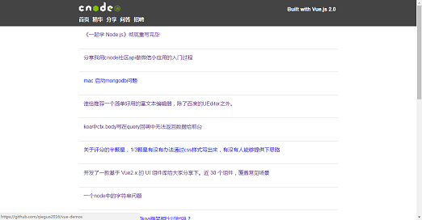

Vue Demo collections (Vue 2.0)
------

> **A Vue.js Demo Collections of Vue 2.o  
  一个 Vue2.0 的 Demo 集**
  
### Summary

Vue2.0的demo集，所有demo的前端都基于Vue2.0、Vuex、Vue-router、axios，使用webpack 2管理模块资源，未涉及ssr，均为静态文件伺服。

后端基于express + superagent等库搭建，主要为代理转发以解决跨域、图片防盗链等权限问题。

PS：这是一个多个项目的集合，为了提高效率，开发时只处理一个应用，所以需要设置config内的两个path。生产环境中会伺服dist文件夹内的所有项目，默认路径为config内的publicPath。

### Index

1. [知乎日报](#知乎日报)  

2. [cnode论坛](#cnode论坛)

### How to use

``` bash
# install dependencies
npm install

# set current demo by rewrite the two path of config.js
module.exports = {
	SERVER_PORT: 8090,	// port
	publicPath: '/daily/',	// need to be change
	srcPath: './src/zhihudaily/',	// need to be change
}

# develop environment
npm run dev

# build for production with minification
npm run build

# start server for production (Note: need to build first)
npm start

```

### 知乎日报

[Live Demo](http://demo.qieguo.me/zhihudaily/)/ [Source Code]()


### CNode论坛

[Live Demo](http://demo.qieguo.me/cnode/) / [Source Code]()


